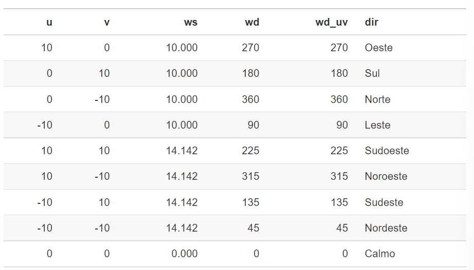
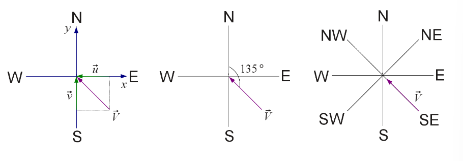

```{r setup, include=FALSE}
knitr::opts_chunk$set(echo = TRUE)
```

## Ecercícios

1. Crie vetor com os valores de e^{x}cos{x} para os valores de $x = (3,3.1,3.2,..,6)$.


```{r}
x <- seq(3,6, by =0.1)
vetor_resul <-  vector(mode="numeric")

for(i in x) {
    result <- exp(i)*cos(i)
    vetor_resul <- append(vetor_resul, result)
}
vetor_resul
```

2. Crie os seguintes vetores.

a. $(0.1^{3}\times0.2^{1}, 0.1^{6}\times0.2^{4}, ..., 0.1^{36}\times0.2^{34})$

b. $(2, \frac{2^{2}}{2}, \frac{2^{3}}{3}, ..., \frac{2^{25}}{25})$

a)
```{r}
options(digits = 3)  
vetor_a <-  vector(mode="numeric")
elevado_1 <- seq(3,36, by =3)
elevado_2 <- seq(1,34, by =3)

for(i in 1:length(elevado_1)){
    a <- (0.1^elevado_1[i] * 0.2^elevado_2[i])
    vetor_a <- append(vetor_a, a)
    
}
vetor_a

```
b)
```{r}
vetor_b <-  vector(mode="double")
denomi_elevador <- seq(1,25, by =1)

for(i in 1:length(denomi_elevador)){
    b <- (2^denomi_elevador[1])/denomi_elevador[i]
    vetor_b <- append(vetor_b, b)
    
}
vetor_b <-round(vetor_b, 3)
vetor_b
```
3. Reproduza a criação do vetor dias da semana (dds) mostrado abaixo

```
domingo segunda   terca  quarta  quinta   sexta   sabado
1         2         3     4        5       6        7
```

```{r}
dds <- c(
  domingo = 1, 
  segunda = 2,
  terca = 3,
  quarta = 4, 
  quinta = 5, 
  sexta = 6, 
  sabado = 7 
  )

dds
```

4. Interprete o resultado da seguinte operação:

```{r}
dds_nums <- c(
  5L, 2L, 5L, 2L, 7L, 7L, 2L,
  6L, 6L, 3L, 7L, 1L, 2L, 2L,
  5L, 7L, 3L, 2L, 6L, 4L, 1L
)
names(dds)[dds_nums]
```

```
i) o vetor dds_nums é dado por 21 valores inteiros (uso do "L" ao final)
```
```{r}
dds_nums
```
```
ii) names(dds) retorna os "nomes" do objeto dds, ou seja, os dias da semana em strings
```

```{r}
names(dds)
```

```
iii) por fim, names(dds)[dds_nums], está retornando os nomes do vetor dds nas posições dds_nums.
```


5. a. Escreva o código necessário para determinar o vetor lógico indicando quais números são pares na sequência de valores 85, 79, 70, 6, 32, 8, 17, 93, 81, 76. 
b. Calcule o total de números ímpares.

a)
```{r} 
vetor_sequen <- c(85, 79, 70, 6, 32, 8, 17, 93, 81, 76)
x_logico <- vetor_sequen %% 2 == 0
x_logico

```
b)
```{r}
x_impar <- vetor_sequen[!x_logico]

total_impar <- length(x_impar)
total_impar
```
6. Para um ano ser bissexto, ele deve ser: 

. divísivel por 4 (a divisão é exata com resto igual a zero)
. não pode ser divisível por 100 (a divisão não é exata, ou seja, o resto é diferente de zero)
. pode ser que seja divisível por 400: caso seja divisível por 400, a divisão deve ser exata, deixando o resto igual a zero.

Com os critérios definidos acima, construa o código para:

a. Verificar se os anos 1894, 1947, 1901, 1992, 1925, 2014, 1993, 1996, 1984, 1897, 2100, 2300 são bissextos.

```{r}
vetor_anos <- c(1894, 1947, 1901, 1992, 1925, 2014, 1993, 1996, 1984, 1897, 2100, 2300)

bissexto_1 <- vetor_anos %% 4 == 0
bissexto_2 <- vetor_anos %% 100 == 0
bissexto_3 <- vetor_anos %% 400 == 0

x_logico_bissexto <- (bissexto_1 & !bissexto_2)| bissexto_3
x_logico_bissexto

```

b. Mostre quais anos são bissextos.

```{r}
x_anos_bissexto <- vetor_anos[x_logico_bissexto]
x_anos_bissexto

```
c. Usando o código para verificar se o ano é bissexto, gere um vetor nomeado ndias com o número de dias do ano para os anos do item (a).

#```{r}
#yrs <- vetor_anos
#yrs<- lubridate::ymd(yrs, truncated = 2L)

#next_year <- yrs + years(1)
#(yrs %--% next_year) / ddays(1)
#```

```{r}
ndias <- vector(mode="numeric")

for (i in 1:length(x_logico_bissexto)){
     if (x_logico_bissexto[i]==TRUE){ 
         ndias[i] <- 366
         }
     else if (x_logico_bissexto[i]==FALSE){
       ndias[i] <- 365
       }
}

ndias
```

d. Programe como obter o total de anos com 366 dias?

```{r}

total_anos_bi <- length(x_anos_bissexto)
total_anos_bi
```
7. Quais códigos para gerar os seguintes dados:

a) [1] -30   0   5  10  15  20  30


```{r}
x <- seq(1,6, by=1)
r = 30
a <- c(-30, (-30 + x*r)/6,30)
a
```

b) [-1] 1.0 0.8 0.6 0.4 0.2 0.0

```{r}
x <- seq(0,5, by=1)
r = 0.2
b <- c(1 - x*r)
b
```
c) [1] -3.1415927 -2.4434610 -1.7453293 -1.0471976 -0.3490659  0.3490659
   [7]  1.0471976  1.7453293  2.4434610  3.1415927

```{r}
options(digits=8)
a <- -pi
r <- -pi/4.5
x <- seq(0,9, by=1)
c <- c(a - (x*r))
c
```
d) [1] -1 -1  0  0  0  1  1  1  1  2  2  2  2  2  3  3  3  3  3  3  4  4  4
   [24]  4  4  4  4  5  5  5  5  5  5  5  5
   
```{r}
repeticao <- c(2L, 3L, 4L, 5L, 6L, 7L, 8L)
valores <- seq(-1,5, by=1)
for (i in 1:length(repeticao)){
  d <- rep(valores, times=repeticao)
 
}
d
```

e) [1] 5 5 5 5 5 4 4 4 4 3 3 3 2 2 1 2 2 3 3 3 4 4 4 4 5 5 5 5 5

```{r}
repeticao <- c(2L, 3L, 4L, 5L, 6L, 7L, 8L)
valores_1 <- seq(5,1, by=-1)
valores_2 <- seq(1,5, by=1)

for (i in 1:length(valores_1)){
  e <- c(rep(valores_1, times=valores_1),rep(valores_2, times=valores_2))
 
}
e
```

8. Usando o mesmo código para solução em todos os itens abaixo, obtenha as seguintes sequências usando os vetores fornecidos.

a. v3 = (11, 0.25, 7, 2)

```{r}
v <- c(11,0.25,7,2)
v3 <- c(11,0.25,7,2)
which(v %in% v3)

```
b. v2 = (11, 0.25)

```{r}
v <- c(11,0.25,7,2)
v2 <- c(11, 0.25)
which(v %in% v2)
```

c. v1 = (11)
```{r}
v <- c(11,0.25,7,2)
v1 <- c(11)
which(v %in% v1)

```
d. v0 = ()

```{r}
v <- c(11,0.25,7,2)
v0 <- c()
which(v %in% v0)
```

9. Considere os seguintes dados horários de temperatura do ar ($T_{ar}$) registrados em duas estações meteorológicas, entre as 0 e 23 horas de um dado dia.

```{r}
tar_est1 <- c(
  14.92, 14.61, 14.32, 14.07, 13.84, 13.65, 13.56, 13.97, 15.08,
  16.5, 17.88, 19.08, 20.02, 20.66, 21.01, 21.05, 20.76, 20.05,
  18.77, 17.51, 16.67, 16.11, 15.66, 15.27
)
tar_est2 <- c(
  13.13, 13.01, 12.93, 12.87, 12.82, 12.81, 13.2, 14.22, 15.77,
  17.49, 19.2, 20.57, 21.49, 22.01, 22.03, 21.71, 20.84, 18.77,
  16.54, 15.13, 14.34, 13.81, 13.49, 13.28
)
```

```
Dica: Faça um gráfico para visualizar as temperaturas das duas estações. Isso facilitará a solução.
```

a. Determine a média diária da $T_{ar}$ das duas estações arrendondando para uma casa decimal. Salve a média de cada estação nas variáveis tmed_est1 e tmed_est2.

```{r}
tmed_est1  <- mean(tar_est1)
sprintf("Media de temperatura da estacao 1: %#.1f", tmed_est1)

tmed_est2 <- mean(tar_est2)
sprintf("Media de temperatura da estacao 2: %#.1f", tmed_est2)

```

b. Utilizando as variáveis do item anterior, verifique usando comparação lógica, em qual estação o ambiente é mais quente?

```{r}
if (tmed_est1 > tmed_est2){
  sprintf("Ambiente da estacao 1 e o mais quente")
  } else {sprintf("Ambiente da estação 2 e o mais quente")}
```
c. Obtenha a 3ª maior temperatura do dia em cada estação.

```{r}
terceiro_maior_est1 <- Rfast::nth(tar_est1, 3, descending = T)
terceiro_maior_est1

terceiro_maior_est2 <- Rfast::nth(tar_est2, 3, descending = T)
terceiro_maior_est2
```

d. Calcule a amplitude térmica diária ($ATD = T_{max}-T_{min}$, onde $T_{max}$: temperatura máxima dária e $T_{min}$: temperatura mínima dária) das estações 1 e 2, arrendondando para uma casa decimal. Salve os resultados nas variaveis atd_est1 e atd_est2.

```{r}
T_max_est1 = max(tar_est1)

T_max_est2 = max(tar_est2)

T_min_est1 = min(tar_est1)

T_min_est2 = min(tar_est2)


ATD_est1 = T_max_est1 - T_min_est1
ATD_est2 = T_max_est2 - T_min_est2
sprintf("ATD est1: %#.1f", ATD_est1)
sprintf("ATD est2: %#.1f", ATD_est2)
```
e. Qual o horário de ocorrência das temperaturas máximas e mínimas em cada estação? Salve os resultados nas variáveis hmax_est{i} e hmin_est{i}, com  $i = 1,2$.

```{r}
t1 <- T_max_est1
t2 <- T_max_est2
hmax_est <- c(which(tar_est1 %in% t1)-1, which(tar_est2 %in% t2)-1)
hmax_est
```
f. Quando tar_est2 é maior que tar_est1 qual a maior diferença absoluta de temperatura entre as duas estações?

```{r}
v1 <- c(tar_est2[tar_est2 > tar_est1])
v1
v2 <- c(tar_est1[tar_est1 < tar_est2])
v2
```
```{r}
dif <- v1-v2
abs_diff <- abs(dif)
abs_diff
```
g. Qual a hora correspondende a ocorrência daquela maior diferença absoluta de temperatura obtida no item anterior?

```{r}
max_dif <- max(dif)
v_max_est2 <- v1[which(dif %in% max_dif)]
v_max_est2
which(tar_est2 %in% v_max_est2)-1
```
h. O horário do pôr do sol pode ser estimado a partir da $T_{ar}$. Para o período após o horário de ocorrência da $T_{max}$ determina-se em qual hora ocorre a maior queda de $T_{ar}$ em relação a hora anterior. Estime o horário do pôr do sol para as duas estações (hps_est{i}).

```{r}
hmax_posicao <- c(which(tar_est1 %in% t1)+1, which(tar_est2 %in% t2)+1)

my_range_est1 <- c(hmax_posicao[1]:length(tar_est1))
my_range_est2 <- c(hmax_posicao[2]:length(tar_est2))


subset_est1 <- tar_est1[my_range_est1]
subset_est2 <- tar_est2[my_range_est2]


Tmenos_est1 <- diff(subset_est1)
Tmenos_est2 <- diff(subset_est2)


maior_queda_est1 <- max(abs(Tmenos_est1))
maior_queda_est2 <- max(abs(Tmenos_est2))


hsol_est1 <- c(which(Tmenos_est1 %in% (maior_queda_est1*-1)))
hsol_est2 <- c(which(Tmenos_est2 %in% (maior_queda_est2*-1)))


hps_est <- c(my_range_est1[hsol_est1]-1,my_range_est2[hsol_est2]-1)
hps_est

```
i. Calcule a temperatura média diária usando os seguintes métodos para estação 2.

$T_{med_{1}} = (T_{max} + T_{min})/2$ , salvando em uma variável tar_met1.

$T_{med_{2}} = (T_{max} + T_{min} + T_{9} + 2T_{21})/5$, salvando em uma variável tar_met2.
$T_{med_{3}} = (T_{7} + T_{14} + 2T_{21})/4$ , salvando em uma variável tar_met2.


```{r}

tar_met1 <- (max(tar_est2) +min(tar_est2))/2
tar_met1

tar_met2 <- (max(tar_est2) + min(tar_est2) + tar_est2[9] + 2*tar_est2[21])/5
tar_met2

tar_met3 <- (tar_est2[7] + tar_est2[14] +2*tar_est2[21])/4
tar_met3
```
k. Compare este resultados com aqueles obtidos no item a. Qual é melhor? 

```{r}

erro_Re <-c(((tar_met1 - tmed_est2)/tmed_est2)*100,((tar_met2 - tmed_est2)/tmed_est2)*100,((tar_met3 - tmed_est2)/tmed_est2)*100 )

menor_erro <- min(abs(erro_Re))
menor_erro
```
O melhor resultado, mais proximo da calculado em a. é o $T_{med_{3}}$.

10. Calcule a temperatura do ar horária usando o modelo de onda para representação do ciclo diário da temperatura do ar, descrito pelas seguintes equações:

$\left\{\begin{matrix}
h_{T_{min}}\leq h < h_{T_{max}}, & T_{calc} =  \bar{T} - A \, cos\left ( arg \right )\\ 
demais\; horas, & T_{calc} =  \bar{T} + A \, cos\left ( arg \right )
\end{matrix}\right.$

onde: 

$\bar{T} = \left ( \frac{T_{max} + T_{min}}{2} \right )$

e

$A =\left ( \frac{T_{max}-T_{min}}{2} \right )$

O argumento do cosseno ($arg$) é definido por:

$\left\{\begin{matrix}
h <  h_{T_{min}}, & arg = \pi  \left ( \frac{h+10}{10+h_{Tmin}} \right )\\ 
h_{T_{min}}\leq h < h_{T_{max}}, & arg = \pi  \left ( \frac{h-h_{T_{min}}}{14-h_{T_{min}}} \right )\\ 
h > h_{T_{max}},  & arg = \pi\left ( \frac{14-h}{10+h_{Tmin}} \right )
\end{matrix}\right.$

a. Aplique o método acima para estação 1 e 2 substituindo os valores de $T_{max},T_{min}, h_{T_{max}}, h_{T_{min}}$, adequadamente. 

```{r}
options(digits = 4) 
h <- c(seq(0,23, by=1))
T_barra <- c((max(tar_est1) +min(tar_est1))/2,(max(tar_est2)+min(tar_est2))/2)
T_barra

A <- c((max(tar_est1) -min(tar_est1))/2,(max(tar_est2)-min(tar_est2))/2)
A

h_tmin <- c(which(tar_est1 %in% min(tar_est1))-1, which(tar_est2 %in% min(tar_est2))-1)
#h_tmin

h_tmax <- c(which(tar_est1 %in% max(tar_est1))-1, which(tar_est2 %in% max(tar_est2))-1)
#h_tmax
```
```{r}
arg1 <-c()
for (i in 1:24){
  if (h[i] < h_tmin[1]){
      arg1[i] <- c(pi*((h[i]+10)/(10+h_tmin[1])))  
  } else if(h_tmin[1]<= h[i] & h[i]<=h_tmax[1]){ 
      arg1[i]<- c(pi*((h[i]-h_tmin[1])/(14-h_tmin[1])))
  } else if (h[i] > h_tmax[1]){
      arg1[i]<- c(pi*((14- h[i])/(10+h_tmin[1])))
    }
}
arg1
```
```{r}
options(digits = 4) 
ar3 <- arg1[-((h_tmin[1]+1):(h_tmax[1]+1))]
ar3

ar2 <- arg1[(h_tmin[1]+1):(h_tmax[1]+1)]
ar2

ar4 <- arg1[-((h_tmin[2]+1):(h_tmax[2]+1))]
ar4

ar5 <- arg1[(h_tmin[2]+1):(h_tmax[2]+1)]
ar5

```
```{r}
Tcal_i <- T_barra[1] - A[1]*cos(ar3)
Tcal_i2 <- T_barra[1] - A[1]*cos(ar2)

Tcal_i3 <- T_barra[2] - A[2]*cos(ar4)
Tcal_i4 <- T_barra[2] - A[2]*cos(ar5)


T_calc_est1 <- c(Tcal_i,Tcal_i2)
T_calc_est2 <- c(Tcal_i3,Tcal_i4)
sprintf("Tcalc est 1:")
T_calc_est1
sprintf("Tcalc est 2:")
T_calc_est2
sprintf("Tmax est 1 e 2:")
c(max(tar_est1),max(tar_est2))
sprintf("Tmin est 1 e 2:")
c(min(tar_est1),min(tar_est2))
sprintf("h_max est 1 e 2:")
h_tmax
sprintf("h_min est 1 e 2:")
h_tmin

```

b. Calcule o RMSE nos dois casos.
$RMSE = \sqrt{\frac{1}{n}\sum_{i=1}^{n}\left (T_{calc}-T_{obs} \right )^{2}}$

```{r}
RMSE_est1 <-sqrt((1/length(tar_est1)*(sum(T_calc_est1-tar_est1)^2)))

RMSE_est2 <-sqrt((1/length(tar_est2)*(sum(T_calc_est2-tar_est2)^2)))

RMSE <- c(RMSE_est1,RMSE_est2)

sprintf("O RMSE da est 1 e 2:")
RMSE
```
C. Calcule a correlação ($r$) nos dois casos. A barra representa a média aritmética. Confira seu resultado com a saída da função cor(tar_obs, tar_calc).

$r = \frac{\sum_{i=1}^{n} (T_{obs}-\bar{T}_{obs})(T_{calc}-\bar{T}_{calc}))}{\sqrt{\sum_{i = 1}^{n} (T_{obs}-\bar{T}_{obs})^{2}(T_{calc}-\bar{T}_{calc})^{2})}}$

```{r}

d4 <- (tar_est1 - mean(tar_est1))^2
d5 <- (T_calc_est1 - mean(T_calc_est1))^2
d6 <- sum(d4*d5)
 

r_est1 <- sum((tar_est1 - mean(tar_est1))*(T_calc_est1 - mean(T_calc_est1)))/sqrt(d6)
r_est1


d1 <- (tar_est2 - mean(tar_est2))^2
d2 <- (T_calc_est2 - mean(T_calc_est2))^2
d3 <- sum(d1*d2)
  
r_est2 <- sum((tar_est2 - mean(tar_est2))*(T_calc_est2 - mean(T_calc_est2)))/sqrt(d3)
r_est2

r2 <- cor(tar_est1, T_calc_est1)
r2
r3 <- cor(tar_est2, T_calc_est2)
r3
```
R: O resultado é maior do que o dado pela função cor()


11. Os dados abaixo são de precipitação horária de um evento severo ocorrido em 03/12/2012 em Santa Maria-RS.
```{r}
d <- cbind(hora=hora <-c(9,10,11,12,13,14,15,16,17,18,19,20,21), prec = prec<- c(0.0,0.0,0.0,0.0,0.0,0.0,0.0,21.4,41.2,2.6,1.0,0.4,0.0))
# at most 4 decimal places
knitr::kable(d, digits = 4)
```

a. Como seria o código para determinar a soma cumulativa da precipitação horária? Salve o resultado em um vetor chamado prec_acum. Interprete o resultado de c(NA, diff(prec_acum)).

```{r}
prec_acum <- cumsum(prec)
prec_acum

c(NA, diff(prec_acum))

```

R: o comando c(NA, diff(prec_acum)), realiza a subtração entre elementos do vetor prec_acum, contudo no primeiro como não tem um elemento anterior a subtração não existe e é dada o valor NA.

b. Mostre o código para encontrar o horário de ocorrência da precipitação máxima?

```{r}
prec_max <- max(prec)
sprintf("Precipitacao maxima:")
prec_max

posi_prec_max <- which(prec %in% prec_max)
sprintf("posicao:")
posi_prec_max

h_prec_max <- hora[posi_prec_max]
sprintf("hora da prec max:")
h_prec_max

```

c. Mostre o código para obter a hora de início e fim do evento de precipitação severa. Qual foi a duração do evento?

```{r}
prec_sev <- c()
for (i in 2:length(prec)){
  if (prec[i] > prec[i-1]){
      prec_sev[i-1] <- prec[i]
  }
  prec_sev
}

prec_sev_valores <- prec_sev[!is.na(prec_sev)]
posi_prec_sev <- which(prec %in% prec_sev_valores)
h_prec_sev <- hora[posi_prec_sev]
sprintf("hora de início: %#.f h e hora de fim: %#.f h", h_prec_sev[1], h_prec_sev[length(h_prec_sev)]+1)

duracao <- h_prec_sev[length(h_prec_sev)]+1 - h_prec_sev[1]

sprintf("Durcao do evento: %#.f h", duracao)

```

d. Qual foi a precipitação total do evento? Quanto da precipitação total do evento, em %, ocorreu até às 17 h?

```{r}

prec_evev_total <- sum(prec_sev_valores)
sprintf("Precipitacao total durante o evento: %#.f mm", prec_evev_total)

porcent <- 100*(prec_sev_valores[1]/prec_evev_total)

sprintf("Porcentagem da precipitacao total do evento antes das 17h: %#.f '%%'", porcent)
```

12. Considere o vetor x definido pelos números descritos abaixo. Mostre como encontrar o primeiro número positivo localizado após o último número negativo. Por exemplo, seja o vetor z definido pelos valores (11, 10, 15, 2, 6, -15, -10, -22, -8, 5, 7, 2, 12, 8, 4, 1, 3, -3, -1, 30, 14). Os valores selecionados seriam 5 e 30.

```{r}
valores <- c(11, 10, 15, 2, 6, -15, -10, -22, -8, 5, 7, 2, 12, 8, 4, 1, 3, -3, -1, 30, 14)
vector_12 <- c()

for (i in 1:length(valores)){
  if (valores[i] < 0 & valores[i+1] >0 ){
      vector_12[i] <- valores[i+1]
  }
  vector_12
}

vector_12 <- vector_12[!is.na(vector_12)]
vector_12
```
13. Considerando o vetor prec com valores de precipitação diária indicado abaixo. Escreva o código para resolver as seguintes tarefas.

```{r}
prec <- c(
  0, 0, 0, 0.8, 0, 0.01, 0.75, 0,
  0, 0, 0, 0.35, 0.08, 0, 0, 0, 0, 0.31, 0, 3.57, 12.17, 0, 0,
  0, 0.04, 3.16, 0, 0.95, 0.79, 0, 0, 0, 0, 0, 3.51, 0, 0, 0.16,
  0, 0, 8.16, 0.54, 4.39, 1.24, 0, 0, 0, 0, 0, 2.43, 0, 0, 0, 0,
  0, 7.18, 0, 0, 0.26, 0, 0, 0.28, 0, 0, 0.09, 0.38, 0, 0, 0, 0,
  0, 0, 0.51, 0, 0, 0, 0, 0, 0, 0.67, 0, 0, 0, 0, 0.15, 0, 0.82,
  0, 0, 0, 0, 0, 0, 0, 0, 0.37, 0, 0.58, 4.95, 0, 0, 0, 0, 0, 7.68,
  0, 0, 0.37, 0, 1.56, 0, 0, 0, 0.34, 0.48, 0, 4.21, 2.28, 4.3,
  0, 3.38, 0, 0, 0, 0, 7.28, 0, 4.89, 3.91, 0, 0, 0, 0, 0, 0, 2.93,
  0, 2.49, 0.77, 0, 2.9, 3.53, 0.83, 0, 0, 0, 0.94, 0.59, 0, 0,
  0, 0, 0.04, 0, 0.65, 0, 0, 0, 6.23, 0.09, 0, 0.66, 0, 0, 0, 4.42,
  0, 0, 0, 0.84, 0, 0, 0, 0, 0, 0.09, 0, 0, 0.08, 0, 0.66, 0, 0,
  0, 0.06, 0, 0, 0, 3.28, 0, 0.8, 5.69, 0.8, 0
)
```

a. Quantos dias ocorreram no intervalo 0 < prec < 0.25?

```{r}

intervalo_a <- length(prec[0<prec & prec<0.25])
sprintf("Dias em que ocorreram 0 < prec < 0.25: %#.f dias",intervalo_a)

```

b. Substitua os valores de chuva registrados no intervalo 0 < prec < 0.25 por 0.

```{r}

prec_2 <- replace(prec, 0<prec & prec<0.25, 0)
prec_2

```

c. Crie um vetor denominado prec01 indicando o estado da precipitação (chuvoso = 1, seco = 0) baseado no limiar de 0.25 mm para detecção de chuva pelo pluviômetro.

```{r}
prec01 <- c()
prec_a <- replace(prec, 0.25 < prec,1)
prec_b <- replace(prec_a, 0.25 > prec_a,0)
prec01 <- prec_b
prec_b

chuvoso <- replace(prec_b, prec_b==1,"chuvoso")
seco <- replace(chuvoso, chuvoso==0,"seco")
prec_b_2 <- seco

```
d. Qual a probabilidade de chuva dessa série de precipitação diária?

```{r}
options(digits = 4) 
sprintf("Frequencia de evento seco (0)  e chuvoso (1):")
table(prec_b)
probabilidade_1 <- (length(prec_b[prec_b==1])/length(prec_b))*100

sprintf("probabilidade_1 de evento chuvoso (1): %#.2f %%",probabilidade_1)

```
e. Qual a probabilidade de chover dois dias consecutivos (p11)? Calcule a probabilidade de chover em qualquer um de dois dias consecutivos (p01 + p10)?

```{r}
p11 <- c()
p01 <- c()
p10 <- c()
vector_p11 <- c()
vector_p10 <- c()
vector_p01 <- c()

for (i in 1:length(prec_b)){
  if (prec_b[i] == 1 & prec_b[i+1]==1){
       vector_p11[i] <- 1
  }else if(prec_b[i] == 1 & prec_b[i+1]==0){
       vector_p10[i] <- 1
  }
}

for (i in 1:length(prec_b)){
    if(prec_b[i] == 1){ 
           vector_p01[i] <- 1
    }
}


p11 <- (sum(vector_p11[!is.na(vector_p11)])/length(prec_b))*100
sprintf("probabilidade de evento p11: %#.2f %%",p11)
p10 <- (sum(vector_p10[!is.na(vector_p10)])/length(prec_b))*100
p01 <- (sum(vector_p01[!is.na(vector_p01)])/length(prec_b))*100

sprintf("probabilidade de evento p10+p01: %#.2f %%",p10+p01)

```
f. Determine a duração de cada evento chuvoso (número de dias consecutivos).

```{r}
y <- rle(prec_b)
dias <- y$lengths[y$values==1]
sufx<- c(1:length(dias))
evento <- paste0("evento",sufx)
duracao <- cbind(evento, dias)  
duracao
```

14. Dado o vetor dados mostrado abaixo.

```{r}
dados <- c(
  NA, NA, 27L, 7L, 4L, 0L, 26L, 15L, 25L, NA, NA, NA, NA, 6L,
  29L, 18L, 17L, 23L, 20L, 1L, 30L, 13L, NA, NA, NA, NA, NA, NA,
  NA, 19L
)
```
a. Como você pode codificar a obtenção de um vetor com zeros nos valores válidos e com números sequenciais dentro das falhas?

```{r}

dados_2 <- replace(dados,is.na(dados), 1)
dados_2

```

b. Como a partir do vetor resultante do item anterior você pode obter um vetor cujo os valores dentro das falhas indique a ordem de ocorrência da falha.

```{r}
dados_3<-c(dados_2)
count <- 0
for( i in 1:length(dados_3)){
    if(dados_3[i]==1){
        count = count + 1
        dados_3[i] <- count
    }
} 
dados_3

```


c. Qual o código para determinar o tamanho de cada falha?

```{r}
tamanho_falha <- rle(dados_2)$lengths[rle(dados_2)$values==1]
tamanho_falha
```

d. Como determinar o tamanho da maior falha?

```{r}
maior_falha <- max(tamanho_falha)
maior_falha
```


15.Para os valores de velocidade ($V_h$) e a direção do vento ($\theta$) (na convenção meteorológica):

$V_h$ = (10, 10, 10, 10, 14.142, 14.142, 14.142, 14.142, 0)
$\theta$ = (270, 180, 360, 90, 225, 315, 135, 45, 0)

a. Determine as componentes zonal e meridional do vento.

$u = -V_{h} \cdot sin(\theta_{rad})$
$v = -V_{h} \cdot cos(\theta_{rad})$


```{r}
Vh <- c(10, 10, 10, 10, 14.142, 14.142, 14.142, 14.142, 0)
theta <- c(270, 180, 360, 90, 225, 315, 135, 45, 0)

zonal <- round(-Vh *sin(theta*pi/180))
zonal
meridional <- round(-Vh *cos(theta*pi/180))
meridional
```


b. Faça os cálculos necessários para reconstruir $V_h$ e $\theta$ a partir de $u$ e $v$ determinados no item a. Por convenção, a direção do vento $θ$ em condições calmas ($V_h$ <0.5 ms^-1) é assumida como 0°.

$V_{h} = \sqrt{(u^2 + v^2)}$
$\theta_{mat} = {\rm atan2}(-u, -v)\cdot\frac{180}{\pi}$
$\theta = \left\{\begin{matrix}
\theta_{mat} + 360 & se & \theta_{mat} < 0 \\ 
0 & se & u = 0,\:  v = 0 \: \:  ou \: \:  V_{h} < 0.5\\
\end{matrix}\right.$
 
A tabela abaixo apresenta o resultado esperado para as variáveis derivadas.
```{r}

```
Dica: ver a figura abaixo.

```{r}

```

```{r}

Vh_Calu <-sqrt((zonal^2 + meridional^2))
Vh_Calu
theta_mat <- atan2(-zonal,-meridional)*180/pi
theta_mat

(theta_calc <- theta_mat)

for (i in 1: length(theta_calc)){
   if (theta_mat[i] < 0){
        theta_calc[i]<- theta_mat[i]+360
   
   }
}

for (i in 1: length(theta_calc)){
   if (zonal[i]==0 & meridional[i]==0 | (Vh_Calu[i]<0.5)){
        theta_calc[i] <- 0
   
   }
}

u <- zonal
v <- meridional
ws <- Vh_Calu
wd <- theta
wd_uv <- theta_calc
```
16. Para as séries de prec_obs e prec_sim calcule:

a. A proporção corretamente prevista $PC = \frac{wc+dc}{n}$

b. O índice de sucesso crítico $CSI=\frac{wc}{wc+wi+di}$

Onde $w$ e $dc$ são as previsões corretas de dias úmidos ($prec > 0.25$ mm dia^-1) e secos respectivamente, $wi$ e $di$ são as previsões incorretas de dias úmidos e secos respectivamente. $n°$ é o total de previsões.


```{r}
prec_obs <- c(
  0, 0, 0, 0.5, 1, 6, 9, 0.2, 1, 0, 0, 0.25,
  10, 15, 8, 3, 0, 0, 0, 0, 0, 0, 0.25, 0,
  0, 0, 1, 5, 0, 20, 0, 0, 0, 0, 1, 1,
  0, 2, 12, 1, 0, 0, 0, 0, 0, 0, 5, 5
)
prec_sim <- c(
  0, 0.2, 0.1, 0, 0, 3, 1, 1, 1, 1, 0, 3,
  0, 10, 4, 1, 0.3, 0.5, 0.5, 0.5, 0.5, 0, 0.25, 0.25,
  0.25, 0, 0.5, 3, 0, 5, 0, 0, 0, 0, 0.5, 0,
  0.25, 0.2, 0, 0.2, 0, 0, 0, 0, 1, 2, 1, 0
)
```

a. 
```{r}
prec_obs_correta <- prec_obs
prec_obs_wc <- sum(prec_obs_correta > 0.25)
prec_obs_dc <- sum(prec_obs_correta == 0)

Pc_prec_obs <-prec_obs_wc + prec_obs_dc/(length(prec_obs_correta))
Pc_prec_obs

prec_sim_correta <- prec_sim 
prec_sim_wc <- sum(prec_sim_correta > 0.25)
prec_sim_dc <- sum(prec_sim_correta == 0)

Pc_prec_sim  <-prec_sim_wc + prec_sim_dc/(length(prec_sim_correta))
Pc_prec_sim

```
b. 

```{r}
prec_obs_wi <- sum(prec_obs_correta > 0)
prec_obs_di <- sum(prec_obs_correta == 0)
CSI_prec_obs <- prec_obs_wc/(prec_obs_wc+prec_obs_wi+prec_obs_di)
CSI_prec_obs

prec_sim_wi <- sum(prec_sim_correta > 0)
prec_sim_di <- sum(prec_sim_correta == 0)
CSI_prec_sim <- prec_sim_wc/(prec_sim_wc+prec_sim_wi+prec_sim_di)
CSI_prec_sim

```
17. Escreva o código para calcular as estatísticas abaixo, entre os vetores de valores observados (obs) e previstos (prev) por um dado modelo atmosférico, em um dado local.

a. O Viés relativo (%)^[27. Mede a tendência média dos valores previstos (ou simulados) em serem maiores (superestimativa) ou menores (subestiva) que os observados. O valor ótimo é 0, menores valores indicam melhor desempenho. Valores positivos indicam tendência de superestimativa e negativos de subestimativa.↩]


$PBIAS = 100\frac{\sum_{i=1}^{n}(Prev_{i}-Obs_{i})}{\sum_{i=1}^{n}(Obs_{i})}$


b. Coeficente de eficiência de Nash-Sutcliffe (NSE)^[28. NSE é uma estatística normalizada que que determina a magnitude relativa da variância residual (ruído) comparada a variância dos dados medidos (informação). NSE varia de -Inf a 1. Essencialmente, quanto mais próximo a 1, melhor o modelo.↩]


$NSE = 1 - \frac{\sum_{i=1}^{n} (Obs_{i}-Sim_{i})^{2}}{\sum_{i = 1}^{n} (Obs_{i}-\bar{Obs}_{i})^{2}}$


```{r}
v_obs <- c(
  -0.49, 0.27, -0.48, 0.8, -1, 0.1, -1.16,
  0.58, -1.6, -0.31, 0.45, -0.98, 0.19, 0.73,
  -0.49, -0.04, -0.11, 0.46, 2.02, -1.05
)
v_prev <- c(
  NA, -0.49, 0.27, -0.48, 0.8, -1, 0.1, -1.16,
  0.58, -1.6, -0.31, 0.45, -0.98, 0.19, 0.73,
  -0.49, -0.04, -0.11, 0.46, 2.02
)
```


a. 
```{r}
v_obs[is.na(v_obs)] <- 0
v_prev[is.na(v_prev)] <- 0

PBIAS <- 100*sum(v_prev-v_obs)/sum(v_obs)
PBIAS

```
b. 
```{r}
NSE <- 1 - (sum(v_obs-v_prev)^2)/sum((v_obs-mean(v_obs))^2)
NSE
```
